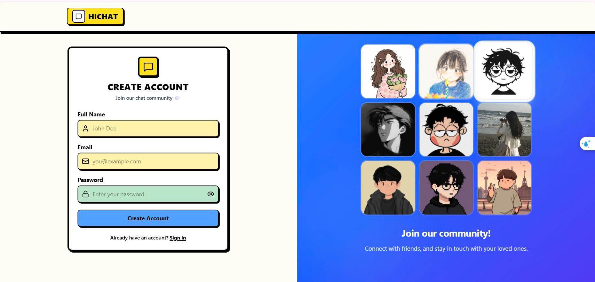
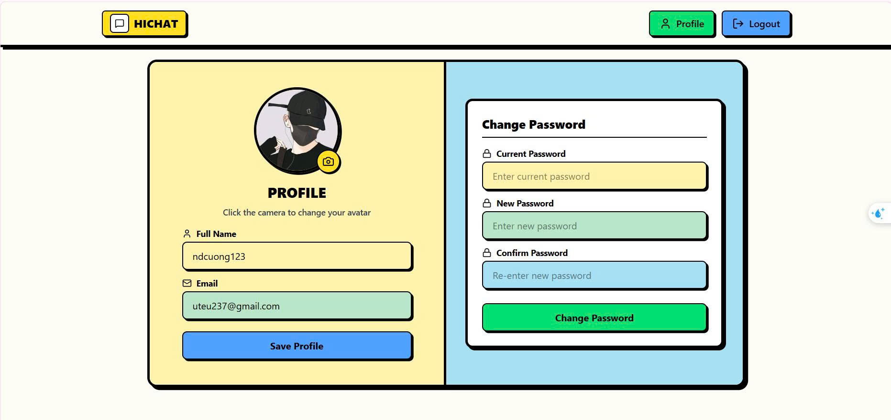
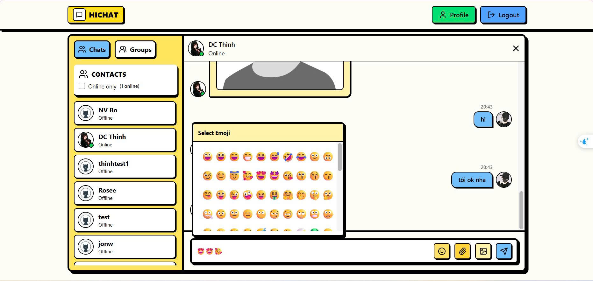
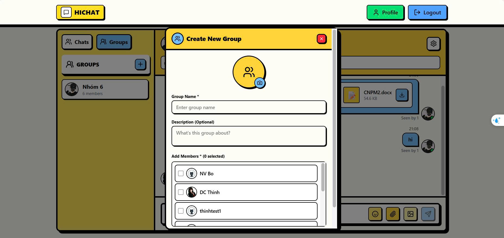
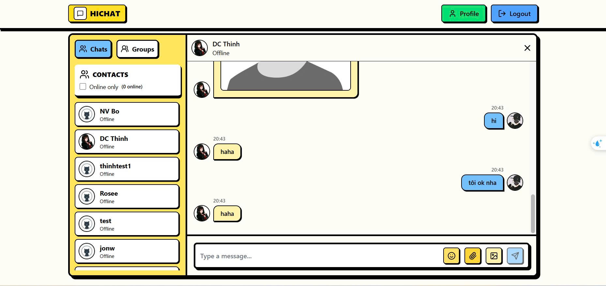
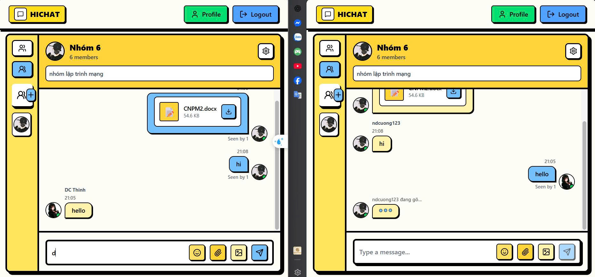

# BÀI TẬP LỚN: LẬP TRÌNH MẠNG  

## ỨNG DỤNG CHAT REAL-TIME HICHAT

> 📘 Ứng dụng chat real-time hoàn chỉnh với đầy đủ tính năng chat 1-1, group chat, file sharing, typing indicators, check user see message và online status tracking.

---

## 🧑‍💻 THÔNG TIN NHÓM

| STT | Họ và Tên | MSSV | Email | Đóng góp |
|-----|-----------|------|-------|----------|
| 1 | Ngô Văn Bộ | B22DCCN085 | ngovanbo280704@gmail.com | Triển khai hệ thống chat với đăng ký/đăng nhập(backend), Socket.IO real-time, trạng thái đọc tin nhắn, và quản lý nhóm (các tính năng của group chat). |
| 2 | Nguyễn Đức Cường | B22DCCN097 | uteu237@gmail.com | Thiết lập backend và cơ sở dữ liệu, cập nhật UI, triển khai socket, tính năng cập nhật hồ sơ, đổi mật khẩu, cải thiện cài đặt nhóm và giao diện sidebar. |
| 3 | Đinh Công Thịnh | B22DCCN830 | thinhdc05@gmail.com | Phát triển và tích hợp các tính năng như đăng ký, đăng nhập(frontend), route tin nhắn,gửi File, triển khai chức năng thời gian thực (chỉ báo gõ) sử dụng Socket. |

**Tên nhóm:** Nhóm 6  
**Chủ đề đã đăng ký:** Ứng dụng Chat Real-time với Socket.IO

---

## 🧠 MÔ TẢ HỆ THỐNG

Hệ thống chat real-time cho phép người dùng giao tiếp trực tuyến với nhau thông qua tin nhắn văn bản, hình ảnh và file đính kèm. Ứng dụng hỗ trợ cả chat 1-1 (trực tiếp giữa 2 người) và group chat (nhiều người trong một nhóm).

**Đặc điểm chính:**
- 🔐 **Authentication & Authorization:** Đăng ký/đăng nhập với JWT
- 💬 **Chat 1-1:** Tin nhắn trực tiếp giữa 2 người dùng
- 👥 **Group Chat:** Tạo và quản lý nhóm chat với nhiều thành viên
- 📎 **File Sharing:** Gửi/nhận ảnh và file (PDF, DOCX,...)
- ⚡ **Real-time:** Tin nhắn, typing indicators, online status cập nhật tức thì
- ✅ **Read Receipts:** Theo dõi tin nhắn đã đọc/chưa đọc

**Cấu trúc logic tổng quát:**
```
React Client (Frontend)  <-->  Express Server (Backend)  <-->  MongoDB (Database)
      |                              |                              |
   Socket.IO                    Socket.IO                    Mongoose ODM
   (WebSocket)                  (WebSocket)
      |                              |
      +------------------------------+
           Real-time Communication
                     |
              Cloudinary (File Storage)
```

**Sơ đồ hệ thống:**

```
┌─────────────────────┐         ┌─────────────────────┐         ┌─────────────────────┐
│   React Client      │◄───────►│   Express Server    │◄───────►│     MongoDB         │
│   (Port 5173)       │  HTTP   │   (Port 5001)       │  TCP    │   (Database)        │
│                     │  REST   │                     │         │                     │
│  - Zustand Store    │  API    │  - JWT Auth         │         │  - Users            │
│  - Socket.IO Client │         │  - Controllers      │         │  - Messages         │
│  - Tailwind CSS     │◄───────►│  - Socket.IO Server │         │  - Groups           │
└─────────────────────┘WebSocket└─────────────────────┘         └─────────────────────┘
                                           │
                                           │ HTTPS API
                                           ▼
                                  ┌─────────────────────┐
                                  │    Cloudinary       │
                                  │  (File Storage)     │
                                  │                     │
                                  │  - Images Upload    │
                                  │  - Files Upload     │
                                  │  - CDN Delivery     │
                                  └─────────────────────┘
```

---

## ⚙️ CÔNG NGHỆ SỬ DỤNG

| Thành phần | Công nghệ | Phiên bản | Ghi chú |
|------------|-----------|-----------|---------|
| **Server (Backend)** |
| Runtime | Node.js | 20.x | JavaScript runtime |
| Framework | Express.js | 5.1.0 | Web framework |
| Database | MongoDB | - | NoSQL database |
| Cache | Redis | 7.x | Cache dữ liệu backend |
| Real-time | Socket.IO | 4.8.1 | WebSocket library |
| Authentication | JWT + bcryptjs | 9.0.2 / 3.0.2 | Token & password hashing |
| File Storage | Cloudinary | 2.8.0 | Cloud storage |
| Security | Helmet + express-rate-limit + Zod | 8.2.0 / 8.5.2 / 4.4.3 | Security headers, rate limit, validation |
| API Docs | Swagger UI / OpenAPI | 5.0.1 | Tài liệu API tương tác |
| Local Infra | Docker Compose | - | Chạy MongoDB và Redis local |
| **Client (Frontend)** |
| Framework | React | 19.1.1 | UI library |
| Build Tool | Vite | Latest | Fast build tool |
| State Management | Zustand | 5.0.8 | Lightweight store |
| Styling | Tailwind CSS | 4.1.16 | Utility-first CSS |
| HTTP Client | Axios | 1.13.1 | Promise-based requests |
| Routing | React Router DOM | 7.9.5 | Client-side routing |
| Real-time | Socket.IO Client | 4.8.1 | WebSocket client |
| Icons | Lucide React | 0.548.0 | Icon library |
| Notifications | React Hot Toast | 2.6.0 | Toast notifications |

---

## 🚀 HƯỚNG DẪN CHẠY DỰ ÁN

### **Yêu cầu hệ thống**
- Node.js 20.x trở lên
- MongoDB (local hoặc MongoDB Atlas)
- Redis (local hoặc Docker)
- Tài khoản Cloudinary (free tier)
- Docker Desktop (nếu chạy MongoDB/Redis bằng Docker Compose)

---

### **1. Clone repository**
```powershell
git clone https://github.com/CuongND04/chat-mern.git
cd chat-mern
```

---

### **2. Cài đặt & chạy Server**

```powershell
# Di chuyển vào thư mục server
cd source/server

# Cài đặt dependencies
npm install

# Tạo file .env với nội dung:
# PORT=5001
# MONGODB_URI=mongodb://127.0.0.1:27018/chat-app
# REDIS_URL=redis://127.0.0.1:6380
# CACHE_TTL_SECONDS=60
# MESSAGE_PAGE_LIMIT=50
# MESSAGE_PAGE_MAX_LIMIT=100
# JWT_SECRET=your_secret_key_here
# CLOUDINARY_CLOUD_NAME=your_cloud_name
# CLOUDINARY_API_KEY=your_api_key
# CLOUDINARY_API_SECRET=your_api_secret

# Chạy server (development mode)
npm run dev
```

> **Nếu muốn chạy MongoDB và Redis bằng Docker Compose từ thư mục gốc dự án:**
```powershell
docker compose down --remove-orphans
docker compose up -d
docker compose ps
```
> MongoDB Docker: `127.0.0.1:27018`  
> Redis Docker: `127.0.0.1:6380`  
> Mở trên MongoDB Compass: `mongodb://127.0.0.1:27018/chat-app`

✅ Server chạy tại: **http://localhost:5001**  
📚 Swagger API Docs: **http://localhost:5001/api-docs**  
📄 OpenAPI JSON: **http://localhost:5001/api-docs.json**

---

### **3. Cài đặt & chạy Client**

Mở terminal mới:

```powershell
# Di chuyển vào thư mục client
cd source/client

# Cài đặt dependencies
npm install

# Chạy client (development mode)
npm run dev
```

✅ Client chạy tại: **http://localhost:5173**

---

### **4. Kiểm thử nhanh**

**Đăng ký tài khoản:**
1. Truy cập http://localhost:5173/signup
2. Nhập Full Name, Email, Password
3. Click "Create Account"

**Gửi tin nhắn:**
1. Đăng nhập với tài khoản vừa tạo
2. Chọn user từ Sidebar (hoặc tạo group)
3. Nhập tin nhắn hoặc upload ảnh/file
4. Tin nhắn hiển thị real-time!

---

## 🔗 GIAO TIẾP (GIAO THỨC SỬ DỤNG)

### **REST API Endpoints**

**Tài liệu API tương tác:**  
- Swagger UI: `http://localhost:5001/api-docs`  
- OpenAPI JSON: `http://localhost:5001/api-docs.json`

#### **Authentication (`/api/auth`)**
| Endpoint | Method | Description | Input | Output |
|----------|--------|-------------|-------|--------|
| `/signup` | POST | Đăng ký tài khoản mới | `{fullName, email, password}` | `{user object}` |
| `/login` | POST | Đăng nhập | `{email, password}` | `{user object + JWT cookie}` |
| `/logout` | POST | Đăng xuất | — | `{message: "Logged out"}` |
| `/check` | GET | Kiểm tra auth status | — | `{user object}` |
| `/update-profile` | PUT | Cập nhật thông tin user | `{fullName, email, profilePic, bio, location}` | `{updated user}` |
| `/change-password` | PUT | Đổi mật khẩu | `{currentPassword, newPassword}` | `{message: "Password updated"}` |

#### **Messages (`/api/messages`)**
| Endpoint | Method | Description | Input | Output |
|----------|--------|-------------|-------|--------|
| `/users` | GET | Lấy danh sách users (sidebar) | — | `[{user objects with unreadCount}]` |
| `/:id` | GET | Lấy tin nhắn với user | `?limit=20&before=<ISO_DATE>` | `[{message objects}]` |
| `/send/:id` | POST | Gửi tin nhắn đến user | `{text, image, file}` | `{message object}` |
| `/read/:id` | PUT | Đánh dấu đã đọc tin nhắn | — | `{message: "Marked as read"}` |

> **Ghi chú:** API lịch sử tin nhắn hiện hỗ trợ phân trang bằng `limit` và `before`. Khi còn dữ liệu cũ hơn, server trả về header `X-Next-Cursor`.

#### **Groups (`/api/groups`)**
| Endpoint | Method | Description | Input | Output |
|----------|--------|-------------|-------|--------|
| `/create` | POST | Tạo group mới | `{name, description, memberIds, groupPic}` | `{group object}` |
| `/` | GET | Lấy danh sách groups | — | `[{group objects with unreadCount}]` |
| `/:groupId/messages` | GET | Lấy tin nhắn của group | `?limit=20&before=<ISO_DATE>` | `[{message objects}]` |
| `/:groupId/send` | POST | Gửi tin nhắn trong group | `{text, image, file}` | `{message object}` |
| `/:groupId/read` | PUT | Đánh dấu đã đọc (group) | — | `{message: "Marked as read"}` |
| `/:groupId/members` | POST | Thêm thành viên vào group | `{memberIds: [userId1, userId2]}` | `{updated group}` |
| `/:groupId/members/:memberId` | DELETE | Xóa thành viên khỏi group | — | `{message: "Member removed"}` |
| `/:groupId` | PUT | Cập nhật thông tin group | `{name, description, groupPic}` | `{updated group}` |
| `/:groupId/leave` | POST | Rời khỏi group | — | `{message: "Left group"}` |

> **Ghi chú:** API lịch sử group cũng hỗ trợ phân trang bằng `limit` và `before`, tương tự chat 1-1.

---

### **WebSocket Events (Socket.IO)**

#### **Client → Server (Emit)**
| Event | Payload | Description |
|-------|---------|-------------|
| `typing` | `{receiverId}` | Đang gõ tin nhắn 1-1 |
| `stop-typing` | `{receiverId}` | Ngừng gõ |
| `joinGroup` | `{groupId}` | Join group chat room |
| `leaveGroup` | `{groupId}` | Leave group room |
| `groupTyping` | `{groupId, isTyping}` | Đang gõ trong group |

#### **Server → Client (On)**
| Event | Payload | Description |
|-------|---------|-------------|
| `getOnlineUsers` | `[userId1, userId2, ...]` | Danh sách users online |
| `newMessage` | `{message object}` | Tin nhắn mới (1-1 chat) |
| `message_seen_update` | `{senderId, receiverId}` | Đã đọc tin nhắn |
| `user-typing` | `{userId, isTyping}` | User đang gõ |
| `newGroupMessage` | `{groupId, message}` | Tin nhắn mới trong group |
| `groupUserTyping` | `{groupId, userId, isTyping}` | Thành viên đang gõ trong group |
| `newGroup` | `{group object}` | Được thêm vào group |
| `groupUpdated` | `{group object}` | Group info thay đổi |
| `memberLeftGroup` | `{groupId, userId}` | Thành viên rời khỏi group |
| `removedFromGroup` | `{groupId}` | Bị xóa khỏi group |

---

## 📊 KẾT QUẢ THỰC NGHIỆM

### **Giao diện chính**







### **Tính năng đã test:**
✅ Đăng ký và đăng nhập thành công  
✅ Gửi/nhận tin nhắn real-time  
✅ Upload ảnh/file lên Cloudinary  
✅ Typing indicator hiển thị khi đang gõ  
✅ Check user see message cập nhật khi mở chat  
✅ Online status tracking chính xác  
✅ Tạo group và thêm/xóa members  
✅ Group chat với nhiều người  
✅ Download file attachments   

---

## 🧩 CẤU TRÚC DỰ ÁN

```
chat-mern/
├── README.md                    # Tài liệu chi tiết (file này)
├── INSTRUCTION.md               # Hướng dẫn từ giảng viên
├── docker-compose.yml           # Chạy MongoDB và Redis bằng Docker
├── statics/                     # Hình ảnh minh họa
│   ├── diagram.png
│   └── (screenshots...)
└── source/                      # Mã nguồn chính
    ├── .gitignore
    │
    ├── client/                  # Frontend React
    │   ├── package.json
    │   ├── vite.config.js
    │   ├── public/
    │   │   └── statics/         # Static assets
    │   └── src/
    │       ├── main.jsx         # Entry point
    │       ├── App.jsx          # Root component
    │       ├── components/      # React components (15+)
    │       │   ├── ChatContainer.jsx
    │       │   ├── GroupChatContainer.jsx
    │       │   ├── Sidebar.jsx
    │       │   ├── CreateGroupModal.jsx
    │       │   └── ...
    │       ├── pages/           # Route pages (4)
    │       │   ├── HomePage.jsx
    │       │   ├── LoginPage.jsx
    │       │   ├── SignUpPage.jsx
    │       │   └── ProfilePage.jsx
    │       ├── store/           # Zustand stores (3)
    │       │   ├── useAuthStore.js
    │       │   ├── useChatStore.js
    │       │   └── useGroupStore.js
    │       └── lib/             # Utilities
    │           ├── axios.js
    │           └── utils.js
    │
    └── server/                  # Backend Express
        ├── .env.example         # Biến môi trường mẫu
        ├── package.json
        └── src/
            ├── index.js         # Entry point
            ├── config/          # Đọc biến môi trường
            ├── controllers/     # Business logic (3)
            │   ├── auth.controller.js
            │   ├── message.controller.js
            │   └── group.controller.js
            ├── models/          # Database schemas (3)
            │   ├── user.model.js
            │   ├── message.model.js
            │   └── group.model.js
            ├── routes/          # API routes (3)
            │   ├── auth.route.js
            │   ├── message.route.js
            │   └── group.route.js
            ├── middleware/      # Auth, security, error, validation
            ├── schemas/         # Zod validation schemas
            ├── docs/            # OpenAPI / Swagger specification
            └── lib/             # Utilities
                ├── db.js        # MongoDB connection
                ├── socket.js    # Socket.IO setup
                ├── cache.js     # Redis cache helper
                ├── cloudinary.js
                └── utils.js
```

---

## 🎯 CHỨC NĂNG CHÍNH

### **I. Authentication & User Management**
1. Đăng ký tài khoản với email validation
2. Đăng nhập với JWT authentication
3. Đăng xuất và xóa session
4. Cập nhật profile (avatar, name, email, bio, location)
5. Đổi mật khẩu

### **II. Chat 1-1 (Direct Messages)**
6. Danh sách users với online status
7. Badge hiển thị số tin nhắn chưa đọc
8. Gửi tin nhắn text
9. Gửi hình ảnh (upload lên Cloudinary)
10. Gửi file attachments (PDF, DOC, DOCX, XLS, XLSX, ZIP, TXT - tối đa 10MB)
11. Typing indicators ("User đang gõ...")
12. Read receipts (hiển thị "Read" khi đã đọc)
13. Download file attachments

### **III. Group Chat**
14. Tạo group với tên, mô tả, avatar
15. Chọn members từ danh sách users
16. Danh sách groups với unread count
17. Gửi tin nhắn trong group (text, image, file)
18. Hiển thị tên + avatar người gửi
19. Group typing indicators
20. "Seen by X/Y" status cho tin nhắn group
21. Group Settings (Admin):
    - Xem thông tin group và members
    - Thêm members mới
    - Xóa members (không thể xóa admin)
    - Sửa tên, mô tả, avatar group
22. Rời khỏi group (user thường; admin không thể rời trực tiếp)

### **IV. Real-time Features**
23. Socket.IO connection khi login
24. Online status tracking với dấu xanh
25. Real-time message delivery 
26. Real-time typing indicators
27. Check user see message
28. Real-time group notifications
29. Auto-reconnect khi mất kết nối

---

## 🧩 HƯỚNG PHÁT TRIỂN THÊM

- [ ] **Message Reactions:** Thêm emoji reactions cho tin nhắn
- [ ] **Message Search:** Tìm kiếm tin nhắn theo nội dung
- [ ] **Dark Mode:** Chế độ giao diện tối
- [ ] **Message Encryption:** Mã hóa end-to-end cho tin nhắn
- [ ] **Transfer Admin:** Chuyển quyền admin trong group
- [ ] **Pin Messages:** Ghim tin nhắn quan trọng
- [ ] **Voice Messages:** Gửi tin nhắn voice
- [ ] **Backup & Export:** Export lịch sử chat
- [ ] **Adaptive Rate Limiting:** Tinh chỉnh giới hạn theo IP, người dùng và loại hành vi

---

## 📝 GHI CHÚ

### **Về cấu trúc:**
- ✅ Repo tuân thủ đúng cấu trúc theo `INSTRUCTION.md`
- ✅ README gốc là tài liệu tổng hợp chính của dự án hiện tại
- ✅ Tất cả dependencies được liệt kê trong `package.json`
- ✅ Code được tổ chức theo pattern MVC (Server) và Component-based (Client)

### **Về backend đã bổ sung:**
- ✅ Validation request với Zod cho auth, messages và groups
- ✅ Rate limit cho toàn API và riêng auth endpoints
- ✅ Redis cache cho danh sách users sidebar và danh sách groups
- ✅ Pagination cho API lịch sử tin nhắn bằng `limit` và `before`
- ✅ Swagger/OpenAPI docs để test API trực tiếp
- ✅ Docker Compose cho MongoDB và Redis local

### **Về testing:**
- ✅ Manual testing: Tất cả tính năng đã test thành công

---

## 📚 TÀI LIỆU THAM KHẢO

### **Công nghệ sử dụng:**
- [React Documentation](https://react.dev/) - Official React docs
- [Express.js Guide](https://expressjs.com/) - Express framework
- [MongoDB Manual](https://docs.mongodb.com/) - MongoDB database
- [Socket.IO Documentation](https://socket.io/docs/) - Real-time engine
- [Redis Documentation](https://redis.io/docs/latest/) - Cache
- [Zustand](https://docs.pmnd.rs/zustand) - State management
- [Tailwind CSS](https://tailwindcss.com/) - Utility CSS framework
- [Cloudinary API](https://cloudinary.com/documentation) - File storage
- [Swagger UI Express](https://www.npmjs.com/package/swagger-ui-express) - API docs
- [Docker Compose](https://docs.docker.com/compose/) - Local containers

### **Security & Authentication:**
- [JWT.io](https://jwt.io/) - JSON Web Token introduction
- [bcrypt](https://www.npmjs.com/package/bcryptjs) - Password hashing

### **Learning Resources:**
- [MDN Web Docs](https://developer.mozilla.org/) - Web development reference
- [Node.js Best Practices](https://github.com/goldbergyoni/nodebestpractices) - Node.js coding practices
- [React Design Patterns](https://www.patterns.dev/posts/reactjs) - React patterns

---
